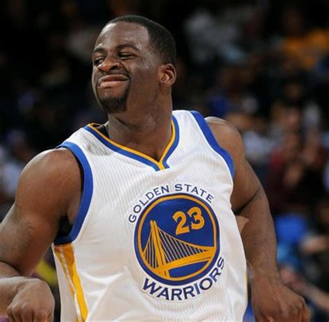

Why Do the Warriors Win?
================
Kyle McEvoy
March 2, 2019

``` r
library(ggplot2)
library(readr)
library(dplyr)
```

    ## 
    ## Attaching package: 'dplyr'

    ## The following objects are masked from 'package:stats':
    ## 
    ##     filter, lag

    ## The following objects are masked from 'package:base':
    ## 
    ##     intersect, setdiff, setequal, union

``` r
shots_data <- read_csv(file = "../data/shots-data.csv", col_names = TRUE, 
                       col_types = cols_only(
                         team_name = col_character(),
                         game_date = col_character(),
                         season = col_character(),
                         period = col_integer(),
                         minutes_remaining = col_integer(),
                         seconds_remaining = col_integer(),
                         shot_made_flag = col_character(),
                         action_type = col_character(),
                         shot_type = col_factor(),
                         shot_distance = col_integer(),
                         opponent = col_character(),
                         x = col_double(),
                         y = col_double(),
                         player = col_character(),
                         minute = col_double()
                       )
                      )
```

    ## Warning: Missing column names filled in: 'X1' [1]

Introduction:
-------------

Why do the Warriors win? According to many fans of other teams, the Golden State Warriors, in acquiring Kevin Durant, have ruined the league, making the games a foregone conclusion. But despite the seeming inevitability of their titles, they still have had to win a lot of games. The question is how have they been so successful? And, is there anything other teams can learn from the Warriors success? Could they build their own juggernaut to topple the Warriors using these insights?

This report seeks to understand one aspect of the Golden State Warriors success: their shooting, and try to figure out some of the reasons their offense has been so good. We'll try to answer the question are the types of shots the Warriors take and the players who take those shots instrumental in their success? In order to explore the question, we'll look at shooting data from the 2016-2017 NBA season for the five players who played together at the end of games: Stephen Curry, Kevin Durant, Klay Thompson, Draymond Green and Andre Iguodala.

Motivation:
-----------

This report seeks to understand some of the Warriors success in shooting. Who are their most effective shooters from different areas of the floor? How do they distribute shots between their best players? What can we learn from this?

Background:
-----------

The Golden State Warriors ranked first in points scored per game at 115.9 and first in Field Goal % at 49.5% in the NBA in the 2016/2017 NBA season.<sup>1</sup> It's clear they were the most successful offense in the league during that season. Their lineup of players at the end of the game was most often Stephen Curry, Kevin Durant, Klay Thompson, Draymond Green, and Andre Iguodala.

Data:
-----

The data used in this report was supplied by the instructors of Stat 133, Spring Semester 2019. There were five original data sets in .csv format. These were combined into a single data set shots-data.csv that was used for the analysis contained in this report. The shots-data.csv and the five original data sets are contained in the data directory of the workout01 repository. All coding for this report was done in the R language.<sup>7</sup>

Analysis:
---------

All analysis was done using charts and scripts made in R. The shots-data.csv file was processed with make-shot-charts.R script into the shooting chart used below. In order to analyze how the Warriors are successful we are going to look at their shooting ability. First let's take a look at the total shots attempted and made by each player.

``` r
player_shots_data <- group_by(shots_data, player)

summarise(player_shots_data, total_shots = sum(shot_made_flag == "shot_yes" | shot_made_flag == "shot_no"), made = sum(shot_made_flag == "shot_yes"), 
          effective_shooting = sum(shot_made_flag == "shot_yes")/sum(shot_made_flag == "shot_yes" | shot_made_flag == "shot_no")) %>% arrange(desc(effective_shooting))
```

    ## # A tibble: 5 x 4
    ##   player         total_shots  made effective_shooting
    ##   <chr>                <int> <int>              <dbl>
    ## 1 Kevin Durant           915   495              0.541
    ## 2 Andre Iguodala         371   192              0.518
    ## 3 Klay Thompson         1220   575              0.471
    ## 4 Stephen Curry         1250   584              0.467
    ## 5 Draymond Green         578   245              0.424

| Name           | Total | Made | % Made |
|----------------|-------|------|--------|
| Kevin Durant   | 915   | 495  | 0.541  |
| Andre Iguodala | 371   | 192  | 0.518  |
| Klay Thompson  | 1220  | 575  | 0.471  |
| Stephen Curry  | 1250  | 584  | 0.467  |
| Draymond Green | 578   | 245  | 0.423  |

When broken down by number of shots and the shooting percentage on the shots, a few things stand out. One, the players Kevin Durant and Andre Iguodala have the two highest shooting percentages on the team, yet Iguodala took the fewest shots and Kevin Durant took only 915 shots, more than 300 fewer than either Stephen Curry or Klay Thompson.

Discussion:
-----------

Why could this be? According to Basketball Reference, Kevin Durant only played 62 games in the 2016-2017 season.<sup>3</sup> He missed the rest of the games due to rest or injury. Having missed nearly a quarter of the season, it makes sense that his shot total would be about a quarter smaller than Stephen Curry and Klay Thompson.

So, why did Iguodala take so few shots despite his high shooting percentage? He played in 76 games, so it can't be due to missing games.<sup>5</sup> Klay Thompson played 2649 minutes during the 2016-2017 season and Stephen Curry played 2638 minutes in the same season.<sup>24</sup> Iguodala only played 1998 minutes.<sup>5</sup>

What could a possible reason for this discrepancy? Why does Iguodala play so few minutes despite being so effective at scoring? The answer could be due to his age. Iguodala was 33 years old during the 2016-2017 season, while his other teammates were only in their late 20s.<sup>5</sup> He could be playing fewer minutes due to his age.

Another, possibility is that it is harder for players to maintain high shooting percentages as they take more shots. That is, if Iguodala increased the number of shots he takes, his shooting percentages might drop precipitously. If that is the case, than allocating fewer shots to him would be a good way to maintain high efficiency on the shots he does end up taking, benefitting the team overall.

This would be a good avenue for future research. One possible method, would be to look at games in which players took more or fewer shots and see if they had different outcomes in shooting percentage. Another possibility would be to look at data across different seasons, and see if seasons in which a player shot more led to decreased shooting percentages.

So how is the offense able to be so successful when the players ranking third and fourth in effective shooting percentage are taking such a high percentage of the shots? It's clear that something more is going on. So, let's compare the shooting percentages on two-point shots and three-point shots.

``` r
shots_data_2PT <-
  filter(player_shots_data, shot_type == "2PT Field Goal")
  
  summarise(
  shots_data_2PT,
  total_twos = sum(shot_made_flag == "shot_yes" |
  shot_made_flag == "shot_no"),
  made_twos = sum(shot_made_flag == "shot_yes"),
  effective_shooting = sum(shot_made_flag == "shot_yes") / sum(shot_made_flag ==
  "shot_yes" |
  shot_made_flag == "shot_no")
  ) %>% arrange(desc(effective_shooting))
```

    ## # A tibble: 5 x 4
    ##   player         total_twos made_twos effective_shooting
    ##   <chr>               <int>     <int>              <dbl>
    ## 1 Andre Iguodala        210       134              0.638
    ## 2 Kevin Durant          643       390              0.607
    ## 3 Stephen Curry         563       304              0.540
    ## 4 Klay Thompson         640       329              0.514
    ## 5 Draymond Green        346       171              0.494

| Player Name    | Total Twos | Made Twos | % Made Twos |
|----------------|------------|-----------|-------------|
| Andre Iguodala | 210        | 134       | 0.638       |
| Kevin Durant   | 643        | 390       | 0.607       |
| Stephen Curry  | 563        | 304       | 0.540       |
| Klay Thompson  | 640        | 329       | 0.514       |
| Draymond Green | 346        | 171       | 0.494       |

In terms of two-point shooting, again Stephen Curry and Klay Thompson trail Iguodala and Durant. But now let's look at three-point shots. Pretty obviously, three points are worth more than two points, right? So, it's possible that Klay and Steph succeed in that area enough to outweigh the amount they trail in two-point shooting.

``` r
shots_data_3PT <- filter(player_shots_data, shot_type == "3PT Field Goal")

summarise(shots_data_3PT, total_threes = sum(shot_made_flag == "shot_yes" | shot_made_flag == "shot_no"),
          made_threes = sum(shot_made_flag == "shot_yes"),
          effective_shooting = sum(shot_made_flag == "shot_yes")/sum(shot_made_flag ==
  "shot_yes" | shot_made_flag == "shot_no")) %>% 
  arrange(desc(effective_shooting))
```

    ## # A tibble: 5 x 4
    ##   player         total_threes made_threes effective_shooting
    ##   <chr>                 <int>       <int>              <dbl>
    ## 1 Klay Thompson           580         246              0.424
    ## 2 Stephen Curry           687         280              0.408
    ## 3 Kevin Durant            272         105              0.386
    ## 4 Andre Iguodala          161          58              0.360
    ## 5 Draymond Green          232          74              0.319

| Player Name    | Total Threes | Made Threes | % Made Threes |
|----------------|--------------|-------------|---------------|
| Klay Thompson  | 580          | 246         | 0.424         |
| Stephen Curry  | 687          | 280         | 0.408         |
| Kevin Durant   | 272          | 105         | 0.386         |
| Andre Iguodala | 161          | 58          | 0.360         |
| Draymond Green | 232          | 74          | 0.319         |

Looking at this chart it looks like we could be onto something. Klay Thompson and Stephen Curry have by far the most three-point attempts on the team and the highest shooting percentages on three-point shots. It makes sense that Klay and Steph would have lower overall shooting percentages since the percentages on three-point shots are lower overall and Steph and Klay have taken a higher percentage of those shots. Looking at Steph's number of three point attempts, it's clear he provides a huge surplus in value. His 280 threes made were worth 280 more points than the same number of two-point shots made. Considering the team averaged 115.9 points per game, it's possible those extra points could have led to more wins.


Image credit.<sup>8</sup>

So maybe there's a more effective way to measure shooting ability. What if we weighted by the points scored per shot? That is what if we counted each made three-point shot as 1.5 shots made compared to two-point shots, and then normalized to total number of shots taken.

``` r
summarise(player_shots_data, total_shots = sum(shot_made_flag == "shot_yes" | shot_made_flag == "shot_no"), made = sum(shot_made_flag == "shot_yes"), 
          effective_shooting = sum(shot_made_flag == "shot_yes")/sum(shot_made_flag == "shot_yes" | shot_made_flag == "shot_no"), adjusted_effective_shooting = effective_shooting + (0.5 * sum(shot_made_flag == "shot_yes" & shot_type == "3PT Field Goal"))/(total_shots)) %>% arrange(desc(adjusted_effective_shooting))
```

    ## # A tibble: 5 x 5
    ##   player       total_shots  made effective_shooting adjusted_effective_sho~
    ##   <chr>              <int> <int>              <dbl>                   <dbl>
    ## 1 Kevin Durant         915   495              0.541                   0.598
    ## 2 Andre Iguod~         371   192              0.518                   0.596
    ## 3 Stephen Cur~        1250   584              0.467                   0.579
    ## 4 Klay Thomps~        1220   575              0.471                   0.572
    ## 5 Draymond Gr~         578   245              0.424                   0.488

| Name           | Total Shots | Shots Made | Made % | Adjusted % |
|----------------|-------------|------------|--------|------------|
| Kevin Durant   | 915         | 495        | 0.541  | 0.598      |
| Andre Iguodala | 371         | 192        | 0.518  | 0.596      |
| Stephen Curry  | 1250        | 584        | 0.467  | 0.579      |
| Klay Thompson  | 1220        | 575        | 0.471  | 0.572      |
| Draymond Green | 578         | 245        | 0.423  | 0.487      |

When looking at the adjusted effective shooting, Durant passes Iguodala as the most effective scorer on the team, and Steph passes Klay Thompson. While a gap still persists between Iguodala's percentage and Stephen Curry and Klay Thompson, the gap drops from 4.6% to 1.6%. Weighting by the value of points scored per shot, provides a better measure of the scoring ability of these players, since we are taking into account the increased value of the three point shot and we aren't penalizing players for taking higher difficulty shots that are worth more.

Another thing to consider, is that the percentages may be dependent on the volume of attempts. It is possible that Iguodala could not score so efficiently if he did take more shots. Or that his teammates are able to leverage the threat of their shots to get Iguodala better looks at the basket.


Looking at the shot charts it's clear that Steph Curry and Klay Thompson are able to be successful by taking a lot of three point shots and making a high percentage of them. But let's look at Andre Iguodala and Draymond Green's charts.

Comparing those charts to the ones for Stephen Curry, Kevin Durant and Klay Thompson, the volume is a lot sparser, as we would expect. In addition it appears that the shot distribution on the floor is a lot less evenly spread. Iguodala and Draymond take very few shots that aren't behind the three point line or very close to the basket. If we assume that the pattern holds between distance and difficulty of shot, this means that other than the three point shots, of which they are taking far fewer than their teammates, they are feasting on looks near the hoop.

This could provide a clue to Iguodala's extremely high percentages. He is taking fewer three point shots and fewer mid-range shots, cleaning up near the basket. His percentage could be so high because he is mostly taking easy shots. We could also hyphothesize that the ability of his higher volume shooting teammates allows him to get these easy looks.

Draymond on the other hand provides a conundrum. That's a whole lot of red covering his chart, and looking back at the tables it doesn't look very pretty either. The team succeeds by limiting his shot attempts, and having his better teammates take more. But then why does such a successful offense employ such a poor shooter?

First, let's acknowledge one limitation of the analysis we have done so far. We have only focused on one aspect of the offensive side of the floor. Draymond as a former Defensive Player of the Year award winner\[6\], clearly provides a lot of value on the defensive side of the game. This could outweigh any consideration of his poor offensive shooting.

Second, we have only focused so far on shooting, but basketball involves a lot of action prior to the shot being hoisted. Players try to dribble around defenders, they set screens, they try to trick their defenders, and they pass the ball to their teammates. It's the last aspect that I think may shed some light on Draymond's value to the team. An assist is credited to a player when they make a pass that leads to a shot being made.

| Player         | Assist Total |
|----------------|--------------|
| Draymond Green | 533          |
| Stephen Curry  | 524          |
| Kevin Durant   | 300          |
| Andre Iguodala | 261          |
| Klay Thompson  | 160          |

(Chart totals are from &lt;www.basketball-reference.com&gt;)

From this chart you can see that Draymond leads the team in assists. He may not shoot much and when he does shoot it may not be pretty, but he performs a valuable role in passing the ball to his teammates.



Image credit.<sup>9</sup>

Conclusion:
-----------

There is a lot more to having a succesful offense than just having players with high percentages take the most shots. It appears that succesful offenses benefit from having players that are effective at distinct but complementary skills. Draymond's passing benefits his teammates providing a boost to the offense, even considering his lower shooting percentages. Curry and Klay have special abilities shooting threes, and the increased value of the three-point shot more than outweighs the negative effects it has on lower overall shooting percentage. Durant's all-around ability make him highly important to the team. He has the highest adjusted shooting percentage, and the third most assists, despite missing nearly a quarter of the season.

Take Home:
----------

There are multiple ways to be a successful contributor to good offense in the NBA. Stephen Curry and Klay Thompson are able to thrive by living behind the three point line, making up for the gap in their shooting percentage on two-point shots by taking and making a ton of threes. Meanwhile, Iguodala plays a balanced role scoring and assisting while not doing too much of either. Draymond is a poor scorer by percentage, but he makes up for it by leading the team in assists. Durant does everything, assisting and scoring at a high level, and he shoots well from every part of the floor. The synergy between the different pieces is what makes their offense the best. If other teams want to beat the Warriors, they might consider building teams where the synergy between their players outweighs concerns of pure shooting.

References:
-----------

1.  Basketball Reference: 2016-17 NBA Season Summary (n.d.)
    Retrieved from <https://www.basketball-reference.com/leagues/NBA_2017.html> On 2019/03/09

2.  Basketball Reference: Klay Thompson. (n.d.)
    Retrieved from <https://www.basketball-reference.com/players/t/thompkl01.html>
    on 2019/03/09.

3.  Basketball Reference: Kevin Durant. (n.d.)
    Retrieved from <https://www.basketball-reference.com/players/d/duranke01.html>
    On 2019/03/09.

4.  Basketball Reference: Stephen Curry. (n.d.)
    Retrieved from <https://www.basketball-reference.com/players/c/curryst01.html>
    On 2019/03/09.

5.  Basketball Reference: Andre Iguodala. (n.d.)
    Retrieved from <https://www.basketball-reference.com/players/i/iguodan01.html>
    On 2019/03/09.

6.  Baskteball Reference: Draymond Green. (n.d.)
    Retrieved from <https://www.basketball-reference.com/players/g/greendr01.html>
    On 2019/03/09.

7.  R Core Team (2018). R: A language and environment for statistical computing. R Foundation for
    Statistical Computing, Vienna, Austria. <https://www.R-project.org/>.

8.  Image downloaded from <http://a.espncdn.com/photo/2017/0424/r202865_608x342_16-9.jpg> On 2019/03/09.

9.  Image originally posted on <http://blacksportsonline.com>. No longer on the website. Downloaded from
    <https://proxy.duckduckgo.com/iu/?u=https%3A%2F%2Ftse4.mm.bing.net%2Fth%3Fid%3DOIP.tgHoSmC-_6O9EmQcEJrqIAHaHQ%26pid%3D15.1&f=1> on 2019/03/09.
